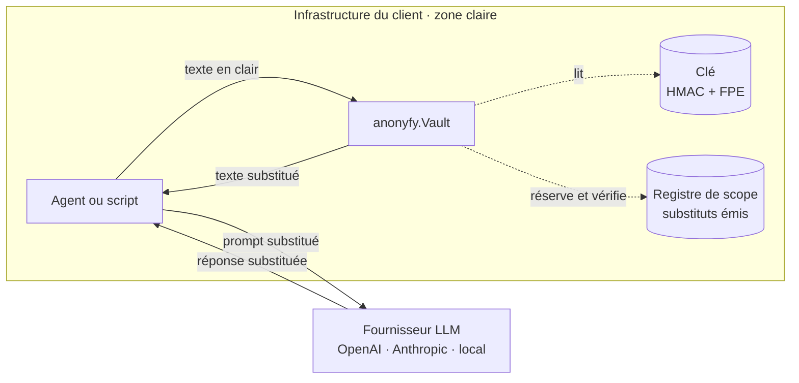
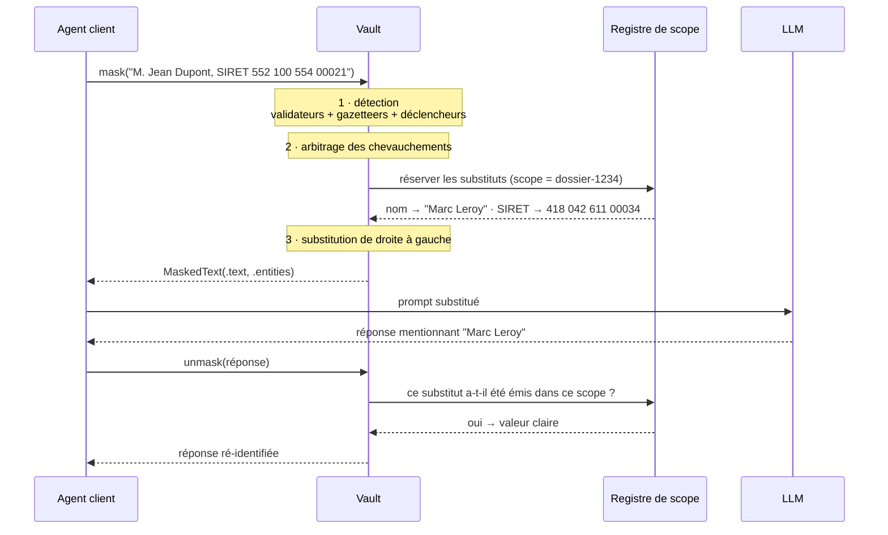
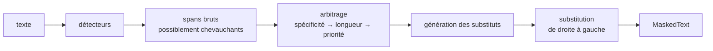
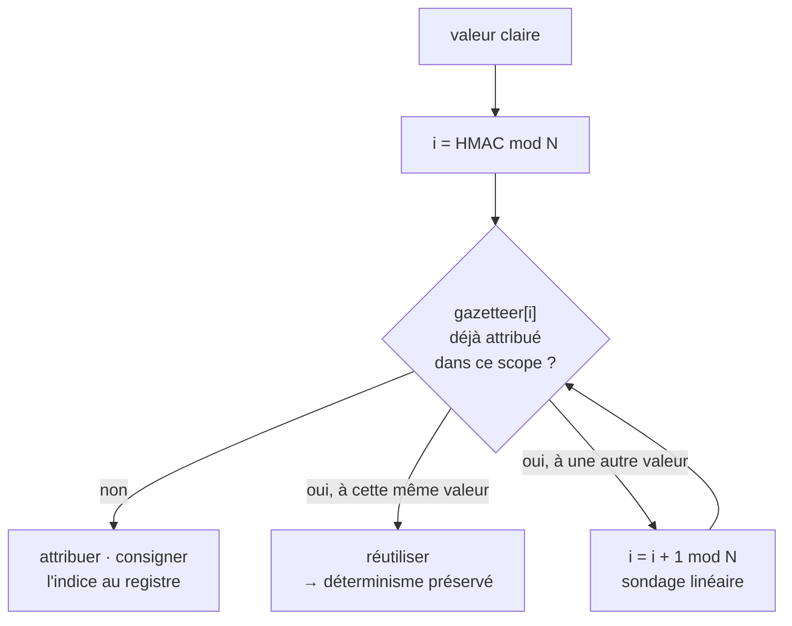
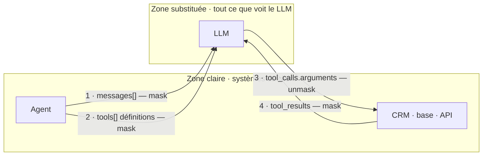

# anonyfy — Architecture

> Document de conception · v0.1 · Août 2026 · Olgean
> Complément de `PRD.md`

---

## 1. Les quatre invariants

Tout le reste découle de ces quatre règles. Si une décision de conception les
contredit, c'est la décision qui a tort.

1. **Le clair ne franchit jamais la frontière.** La valeur d'origine ne quitte pas le
   processus du client. Ni vers un service, ni vers un disque, ni vers un journal.
2. **Déterminisme scopé.** Dans un scope donné, une valeur produit toujours le même
   substitut. C'est ce qui permet à l'agent de garder le fil sur toute une conversation,
   et c'est ce qui préserve le cache de préfixe du fournisseur.
3. **Injectivité dans le scope.** Deux valeurs distinctes ne partagent jamais un
   substitut. Sans cette garantie, `unmask` est ambigu et le modèle fusionne deux
   personnes.
4. **Rien n'est démasqué qui n'ait été masqué.** `unmask` ne transforme que des
   substituts réellement émis. Un identifiant inventé par le modèle reste tel quel.

---

## 2. Vue d'ensemble



La frontière est la seule chose qui compte : à gauche, du clair ; à droite, des
substituts. La clé et le registre restent à gauche, ce qui est précisément ce qui rend
l'argument juridique du PRD §9 défendable.

---

## 3. Le flux aller / retour



Le point non évident est le dernier échange. Sans la vérification auprès du registre,
un identifiant halluciné par le modèle — un SIRET syntaxiquement valide qu'il a
inventé — se « déchiffrerait » lui aussi et produirait une fausse valeur claire
injectée dans le système du client. L'invariant 4 existe pour ça.

---

## 4. Anatomie de `mask()`



**Détecteurs.** Trois familles, dans cet ordre de fiabilité :

- *Validateurs* — regex **plus** contrôle arithmétique (Luhn, mod 97, clé NIR). C'est
  ce qui écrase les faux positifs : une suite de quatorze chiffres n'est un SIRET que
  si la clé de Luhn tombe juste.
- *Gazetteers* — prénoms et noms INSEE, communes du COG, voies. Les patronymes ne sont
  pas régulables ; il n'existe aucune expression régulière du nom propre.
- *Déclencheurs contextuels* — `M.`, `Mme`, `Maître`, `né(e) le`, `demeurant`,
  `ci-après`. Ils élèvent la confiance d'un candidat gazetteer, et permettent d'attraper
  un nom absent des listes.

**Arbitrage.** Le plus spécifique gagne : un SIRET validé bat un « nombre long ». À
spécificité égale, le span le plus long. À égalité, la priorité déclarée. Chaque
arbitrage est journalisé avec l'identifiant de règle — c'est ce qui rend l'outil
auditable, et l'auditabilité est l'argument face à un DPO.

**Substitution de droite à gauche.** On remplace en partant de la fin du texte, sinon
chaque remplacement décale les offsets de tous les spans suivants. Détail trivial,
source de bugs classique.

---

## 5. Génération des substituts

Deux mécaniques selon la nature de la donnée.

### 5.1 Identifiants structurés → chiffrement préservant le format

Pour un SIRET, un NIR, un IBAN, un téléphone : `substitut = FF3-1(clé, valeur)`, puis
recalcul de la clé de contrôle pour que le résultat soit **valide au format**.

Deux propriétés précieuses : la réversibilité est un simple déchiffrement, et
**aucune valeur claire n'est stockée nulle part**. C'est ce qui permet de dire au
client qu'il n'introduit pas une nouvelle base sensible chez lui.

Limite à documenter : FF3-1 s'affaiblit quand l'espace des valeurs possibles est
réduit. Sur un type à faible cardinalité, on bascule sur le mécanisme du §5.2.

### 5.2 Texte libre → sélection déterministe dans un gazetteer

Pour un nom, une commune, une voie :

```
index = HMAC(clé, scope || type || valeur) mod N
substitut = gazetteer[index]
```

Le substitut respecte le type et, quand c'est possible, les attributs qui portent du
sens grammatical : un prénom masculin donne un prénom masculin, pour que les accords
tiennent dans la réponse du modèle.

### 5.3 Le piège : les collisions

**C'est ici que les implémentations naïves cassent, et ça arrive plus tôt qu'on ne
croit.** Avec un gazetteer de 50 000 prénoms, le paradoxe des anniversaires donne
environ 50 % de chances d'avoir au moins une collision dès **263 valeurs distinctes**.

Un dossier de contentieux de masse en contient des milliers. À la première collision,
deux personnes différentes reçoivent le même substitut : le modèle les fusionne, et
`unmask` ne sait plus laquelle restituer. L'invariant 3 tombe.

**Le correctif : le registre de scope.** Le HMAC ne donne pas le substitut, il donne
le *point de départ d'un sondage*. Le registre, propre au scope, retient les indices
déjà attribués :



Le déterminisme est préservé **à l'intérieur du scope**, ce qui est la seule propriété
dont on ait réellement besoin. Il faut l'assumer : le résultat dépend de l'ordre
d'apparition des valeurs dans le scope. Le registre doit donc être persisté avec le
scope, et une reprise de traitement doit le recharger.

**Ce que contient le registre** : des indices et des substituts. **Jamais de valeur
claire** — l'appartenance se vérifie par HMAC, la restitution par déchiffrement FPE ou
par la table inverse chiffrée sous la clé. Le registre reste donc un fichier non
sensible au sens du RGPD, ce qui est la raison d'être de tout le montage.

---

## 6. `unmask()`

Automate d'Aho-Corasick construit sur l'ensemble des substituts émis dans le scope :
une seule passe sur la réponse, indépendamment du nombre d'entités.

Deux subtilités :

- **Le modèle reformate.** Il peut écrire « M. Leroy » quand on avait émis
  « Marc Leroy », ou couper un SIRET en groupes de trois chiffres. L'automate travaille
  donc sur des formes normalisées, et le registre indexe les variantes prévisibles
  d'un substitut.
- **Le modèle invente.** Voir §3 : seuls les substituts présents au registre sont
  restitués. Tout le reste passe inchangé.

---

## 7. Le traitement des appels d'outils

C'est le point où un proxy naïf ne survit pas à un agent réel, et c'est ce qui
manquera à la concurrence. Un agent ne fait pas circuler que de la prose : il envoie
des définitions d'outils, et il reçoit des appels que **le client** exécute pour de
vrai.



**L'invariant qui résume tout** : *tout ce qui entre dans la zone substituée est
masqué, tout ce qui en sort vers un système du client est démasqué.* La frontière est
le LLM — pas le sens de la requête HTTP.

Les quatre passages, et pourquoi aucun n'est optionnel :

| # | Charge utile | Sens | Opération | Conséquence si on l'oublie |
|---|---|---|---|---|
| 1 | `messages[]` | client → LLM | `mask` | Fuite directe. C'est le cas évident. |
| 2 | `tools[]` — descriptions, `enum`, exemples | client → LLM | `mask` | Fuite silencieuse : les schémas d'outils contiennent souvent des exemples tirés de données réelles. Presque toujours oublié. |
| 3 | `tool_calls.arguments` | LLM → client | **`unmask`** | Le client exécute `chercher_client(nom="Marc Leroy")` sur un CRM qui ne connaît pas ce nom. L'agent tourne à vide. |
| 4 | `tool_results` | client → LLM | `mask` | Fuite par la bande : la réponse du CRM contient le clair et repart vers le modèle. |

**Traitement du JSON.** On parcourt l'arbre et on ne touche qu'aux feuilles de type
chaîne. Jamais les clés, jamais les valeurs structurelles, jamais un `function.name`.
Une politique déclare les chemins exemptés :

```python
v.mask_json(payload, exempt=["$.tools[*].function.name", "$.model"])
```

Un remplacement textuel brut sur du JSON sérialisé casse les schémas. C'est la
première chose qui va casser si on prend un raccourci.

---

## 8. Le streaming (v2)

La ré-identification côté réponse travaille sur un flux : un substitut arrive découpé
sur plusieurs chunks. On maintient un tampon glissant et on ne relâche un fragment que
lorsqu'aucun substitut connu ne peut plus commencer à cet endroit — soit une retenue
d'au plus `max(len(substitut)) - 1` caractères.

C'est mécaniquement simple et c'est là que se concentreront les bugs. Raison de plus
pour que la logique de correspondance vive dans le cœur, testable hors réseau, et que
le proxy ne fasse que du transport.

---

## 9. Arborescence

```
anonyfy/
├── detect/
│   ├── validators/      # NIR, Luhn, mod 97, plan de numérotation…
│   ├── gazetteers/      # prénoms et noms INSEE, COG, voies
│   └── context/         # déclencheurs : M., Mme, Maître, né(e) le…
├── resolve/             # arbitrage des chevauchements, politique
├── surrogate/
│   ├── fpe.py           # FF3-1 — identifiants structurés, sans stockage
│   ├── gazetteer.py     # sélection déterministe HMAC → indice
│   └── registry.py      # registre de scope, résolution des collisions
├── vault.py             # API publique : mask · unmask · report
├── audit.py             # journal — jamais de valeur claire
├── json_walk.py         # mask_json / unmask_json (prêt pour la v2)
└── cli.py               # scan · mask · unmask
```

Le cœur ne dépend que de la bibliothèque standard et d'une bibliothèque
cryptographique. Aucun modèle à télécharger, aucun appel réseau : c'est ce qui rend
`uv add anonyfy` suivi d'un premier masquage faisable en trente secondes, et c'est
cette expérience-là qui décide de l'adoption.

---

## 10. Ce que cette architecture ne fait pas

- Elle ne lève pas l'ambiguïté sémantique. « Boulanger » restera un faux positif.
  Le mode observation existe pour que l'utilisateur le découvre avant la production,
  pas après.
- Elle ne protège pas de la ré-identification par le contexte.
- Elle n'anonymise pas. Voir `PRD.md` §9.

Ces trois limites vont dans le README, en clair. C'est ce qui nous distinguera d'un
outil qui promet la conformité.
